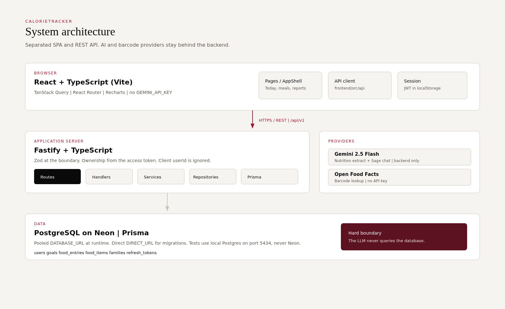
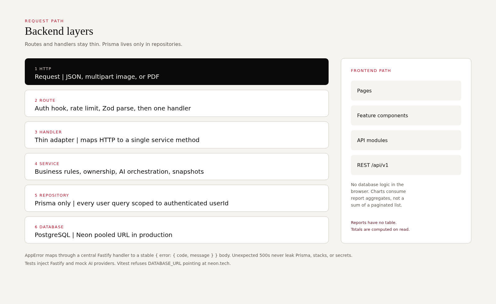
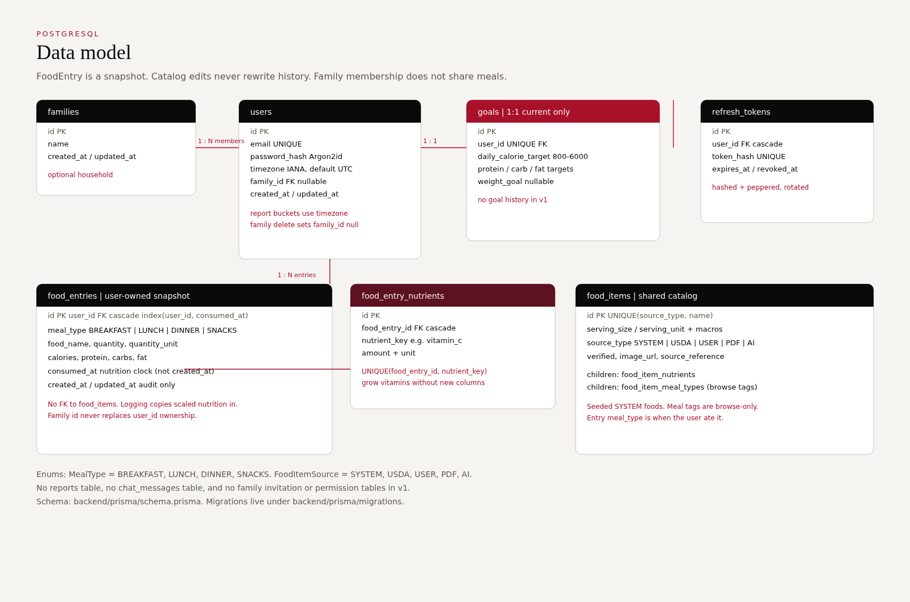
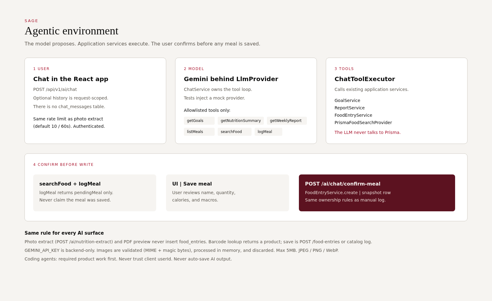

# CalorieTracker

A full-stack personal nutrition tracker. Users set a current daily goal, log meals as snapshots, and read timezone-aware reports. AI can propose nutrition from a photo or a chat turn. **Nothing is written until the user reviews and saves.**

The product is a React SPA talking to a Fastify REST API. PostgreSQL (Neon in hosted environments) is the system of record. Gemini runs only on the backend, behind provider interfaces. The browser never receives `GEMINI_API_KEY`.

Product requirements: [`PROJECT_REQUIREMENTS.md`](PROJECT_REQUIREMENTS.md). Schema: [`backend/prisma/schema.prisma`](backend/prisma/schema.prisma).

---

## Contents

1. [Architecture](#architecture)
2. [Tech stack](#tech-stack)
3. [Features](#features)
4. [Database](#database)
5. [API](#api)
6. [Agentic environment](#agentic-environment)
7. [Engineering decisions and assumptions](#engineering-decisions-and-assumptions)
8. [Security](#security)
9. [Setup](#setup)
10. [Environment variables](#environment-variables)
11. [Testing](#testing)
12. [Project structure](#project-structure)
13. [Rules for coding agents](#rules-for-coding-agents)

---

## Architecture

Frontend and backend are separate applications. The UI talks to the API over HTTPS. The API owns the database, Gemini, and Open Food Facts. Reports are computed on read; there is no `reports` table.



Request handling is layered so routes stay thin and Prisma never appears in handlers.



---

## Tech stack

| Layer | Choice | Why |
| --- | --- | --- |
| Frontend | React, TypeScript, Vite, React Router, TanStack Query, Recharts | SPA with cached server state and charts fed by report APIs |
| Backend | Node.js, TypeScript, Fastify, Zod | Typed HTTP, schema validation at the boundary |
| Data | PostgreSQL, Prisma | Relational ownership model; pooled `DATABASE_URL`, direct `DIRECT_URL` for migrations |
| Hosted DB | Neon | Pooled runtime connection; tests **must not** use Neon |
| AI | Gemini 2.5 Flash, backend only | `NutritionExtractionProvider` / `LlmProvider` so tests inject mocks |
| Barcode | Open Food Facts | No API key. Lookup never auto-saves an entry |
| PDF | `pdfjs-dist` | Text-based diaries only. No OCR, no Gemini |

Do not introduce Express, NestJS, FastAPI, GraphQL, Redis, or other infrastructure that the assignment does not need.

---

## Features

### Core tracker

- **Accounts.** Register, login, refresh, logout, current user. Passwords are Argon2id. Access JWTs are short-lived (default 15 minutes). Refresh tokens are hashed, peppered, rotated, and revoked on logout.
- **One current goal.** Daily calorie target (800–6000 kcal), protein / carb / fat targets, optional weight goal. Create, replace, or delete. No goal history in v1.
- **Meal entries.** Breakfast, lunch, dinner, snacks. Name, quantity, unit, calories, macros, micronutrients, `consumedAt`. The entry is a **snapshot**: later catalog edits do not rewrite it.
- **Catalog.** Seeded `SYSTEM` foods. Pick a food, enter quantity; the server scales nutrition and writes a `FoodEntry`. Browse tags are not the meal type on the entry.
- **Listing.** Filter by `startDate`, `endDate`, `mealType`. Offset pagination, default order `consumedAt DESC`, max `pageSize` 50. Recents return distinct foods the signed-in user has logged.
- **Reports.** Today, calorie trend, macros, micronutrients, goal vs actual, insights. Calendar days use `User.timezone` and `consumedAt`, not `createdAt`. Inclusive range, max 93 days. Goal-vs-actual multiplies the daily goal by the inclusive day count.
- **Photo extract.** JPEG, PNG, or WebP, max 5MB. Gemini returns structured nutrition. The user edits, then saves through the normal food-entry API. Extraction never inserts a row.
- **Sage chat.** Allowlisted tools only. `logMeal` returns a pending meal. Persist with confirm-meal after Save meal.
- **PDF import.** Text-based diaries. Preview, edit, then confirm. Preview never writes. Scanned PDFs are not supported.
- **Family.** Optional household id. Each member keeps their own meals and goals. The family view can show today’s calories; it does not share ledgers.
- **Barcode.** Open Food Facts lookup, then the same review/save path as any other entry.

### Client tools (local UI)

Water, BMI, and the portion calculator are in-app tools. Water and BMI do not persist to the API. Portion “Log this meal” seeds the log-meal form.

### Deferred

Dependent accounts, family meal planning, shared family dashboards, invitations, roles, and permissions are out of scope.

### Screens

Public: `/`, `/about`, `/tutorial`, `/get-started`, `/login`, `/register`.

Signed in: `/dashboard`, `/log-meal`, `/meals`, `/reports`, `/goals`, `/chat`, `/import`, `/family`, `/water`, `/bmi`, `/scan`, `/portions`.

---

## Database



### Tables

| Table | Role |
| --- | --- |
| `families` | Optional household. `id` is the shareable family id. |
| `users` | Account. Unique email, Argon2id hash, IANA `timezone` (default `UTC`), optional `family_id`. |
| `refresh_tokens` | Hashed refresh tokens. Cascade on user delete. Rotated on use, revoked on logout. |
| `goals` | Current goal only. `user_id` is unique (1:1). |
| `food_entries` | What the user ate. Indexed `(user_id, consumed_at)`. **No FK to `food_items`.** |
| `food_entry_nutrients` | Child micros. Unique `(food_entry_id, nutrient_key)` so the vitamin set can grow without new columns. |
| `food_items` | Shared catalog. Unique `(source_type, name)`. Seeded `SYSTEM` rows. |
| `food_item_nutrients` | Catalog micros. |
| `food_item_meal_types` | Browse tags (`BREAKFAST` / `LUNCH` / `DINNER` / `SNACKS`). |

### Enums

- `MealType`: `BREAKFAST`, `LUNCH`, `DINNER`, `SNACKS`
- `FoodItemSource`: `SYSTEM`, `USDA`, `USER`, `PDF`, `AI`

### Intentionally absent

No `reports` table, no `chat_messages` table, no invitation or permission tables. Chat history is request-scoped. Report totals are aggregates of `food_entries` at request time.

---

## API

Base URL: `/api/v1`.

Protected routes take `Authorization: Bearer <accessToken>`. Identity always comes from that token. A client-supplied `userId` is accepted by some schemas so it can be **ignored**, never used as owner.

Error body:

```json
{
  "error": {
    "code": "VALIDATION_ERROR",
    "message": "Human-readable message",
    "details": {}
  }
}
```

Codes: `VALIDATION_ERROR`, `UNAUTHORIZED`, `FORBIDDEN`, `NOT_FOUND`, `CONFLICT`, `RATE_LIMITED`, `PAYLOAD_TOO_LARGE`, `UNSUPPORTED_MEDIA_TYPE`, `AI_PROVIDER_ERROR`, `BARCODE_PROVIDER_ERROR`, `INTERNAL_SERVER_ERROR`.

Ownership misses return **404**, not 403, so other users’ ids are not confirmed.

### Health

| Method | Path | Auth | Notes |
| --- | --- | --- | --- |
| GET | `/health` | No | Liveness / database check |

### Auth (rate-limited, default 20 / 60s except `/me`)

| Method | Path | Auth | Body / result |
| --- | --- | --- | --- |
| POST | `/auth/register` | No | `{ email, password, timezone? }` → 201 `{ user, accessToken, refreshToken }` |
| POST | `/auth/login` | No | `{ email, password }` → 200 tokens |
| POST | `/auth/refresh` | No | `{ refreshToken }` → 200 rotated tokens |
| POST | `/auth/logout` | No | `{ refreshToken }` → 204 |
| GET | `/auth/me` | Yes | 200 `{ user }` |

Duplicate email → 409. Bad credentials or reused refresh → 401.

### Goals (1:1 with the signed-in user)

| Method | Path | Notes |
| --- | --- | --- |
| GET | `/goals` | 200 or 404 |
| POST | `/goals` | 201, or 409 if a goal already exists |
| PUT | `/goals` | Upsert / replace |
| DELETE | `/goals` | 204 |

Calorie target 800–6000. Protein ≤ 300g, carbs ≤ 800g, fat ≤ 250g.

### Food entries

| Method | Path | Notes |
| --- | --- | --- |
| GET | `/food-entries` | Query: `startDate`, `endDate`, `mealType`, `page`, `pageSize` (max 50). Filters `consumedAt`. |
| GET | `/food-entries/recents` | Distinct foods for this user. `limit` 1–20, default 12. |
| POST | `/food-entries` | 201 snapshot |
| GET | `/food-entries/:id` | 404 if missing or not owned |
| PUT | `/food-entries/:id` | Partial update, at least one field |
| DELETE | `/food-entries/:id` | 204 |

Create body: `mealType`, `foodName`, `quantity`, `quantityUnit`, `calories`, `protein`, `carbs`, `fat`, `consumedAt`, optional `micronutrients[]`.

### Catalog

| Method | Path | Notes |
| --- | --- | --- |
| GET | `/food-items` | Query: `mealType`, `q`, `page`, `pageSize` (max 50) |
| GET | `/food-items/:id` | 200 `{ foodItem }` |
| POST | `/food-items/:id/entries` | `{ quantity, mealType, consumedAt }` → scaled `FoodEntry` |

### Reports (on-read aggregates)

| Method | Path | Notes |
| --- | --- | --- |
| GET | `/reports/today` | Today in `User.timezone`. Use this for dashboard totals. |
| GET | `/reports/calories` | `startDate` & `endDate` required, inclusive, max 93 days |
| GET | `/reports/macros` | Per-day series + period totals |
| GET | `/reports/micros` | Alias: `/reports/micronutrients` |
| GET | `/reports/goals` | Alias: `/reports/goal-vs-actual` |
| GET | `/reports/insights` | Averages, days tracked / on target / over, streak |

### AI

| Method | Path | Notes |
| --- | --- | --- |
| POST | `/ai/nutrition-extract` | Multipart image. Rate-limited (default 10 / 60s). Does **not** create an entry. |
| POST | `/ai/chat` | `{ message, history? }`. Same AI rate limit. Tools listed below. |
| POST | `/ai/chat/confirm-meal` | Persists a pending meal through `FoodEntryService`. Not on the chat limiter. |

### Import, barcode, family

| Method | Path | Notes |
| --- | --- | --- |
| POST | `/imports/food-diary/preview` | Multipart PDF, rate-limited. Max 5MB, 30 pages, 100 previewed meals. |
| POST | `/imports/food-diary/confirm` | JSON. All-or-nothing `createMany`. |
| POST | `/barcode/lookup` | Packaged product from Open Food Facts |
| GET | `/family` | Current household and members |
| POST | `/family` | Create |
| POST | `/family/join` | `{ familyId }` |
| POST | `/family/leave` | Leave; meals stay on the user |

CORS: local Vite, the Vercel production origin, and extra origins in `CORS_ORIGIN`. `*` is not allowed.

---

## Agentic environment

Sage is an **application tool loop**, not an agent with a database.



### What the model is allowed to do

`ChatService` talks to Gemini through `LlmProvider`. Tool calls go to `ChatToolExecutor`, which calls existing services:

| Tool | Service | Writes? |
| --- | --- | --- |
| `getGoals` | `GoalService` | No |
| `getNutritionSummary` | `ReportService` | No |
| `getWeeklyReport` | `ReportService` | No |
| `listMeals` | `FoodEntryService` | No |
| `searchFood` | catalog search | No |
| `logMeal` | none | Returns `pendingMeal` only |

The model never receives a Prisma client. It never passes `userId`. `logMeal` must not claim the meal was saved.

### Confirm path

1. Chat returns a pending meal.
2. The UI shows Save meal.
3. `POST /api/v1/ai/chat/confirm-meal` creates the `FoodEntry` with the same ownership rules as a manual log.

Photo extract and PDF preview follow the same rule: propose, review, then a normal write.

### What is not stored

There is no chat-history table. Optional `history` on `/ai/chat` is request-scoped. Tests inject mock `LlmProvider` and `NutritionExtractionProvider` implementations and must not call Gemini.

### Environment for Cursor / coding agents

This repo is meant to be changed in small, reviewable steps.

- `PROJECT_REQUIREMENTS.md` is the product source of truth.
- This README is the technical source of truth (architecture, API, assumptions, agent rules).
- Required tracker work comes before extras.
- Do not add Express, NestJS, GraphQL, Redis, or a second ORM.
- Do not put Prisma in routes or handlers.
- Do not trust client `userId`.
- Do not auto-save AI or PDF output.
- Do not commit `.env` files or secrets.
- Do not restyle the signed-in app to a second brand palette unless asked.
- A phase is not done until its tests pass.

---

## Engineering decisions and assumptions

These are the v1 contracts. Changing one of them is a product decision, not a drive-by refactor.

1. **Auth is core infrastructure.** Multi-user appears as a bonus in the assignment brief. The implementation treats register / login / refresh / logout / me as Phase 1 so every goal and meal has an owner.

2. **One current goal.** `goals.user_id` is unique. There is no history table.

3. **`consumedAt` is the nutrition clock.** Date filters and reports use when the meal was eaten. `createdAt` is audit-only.

4. **Timezone lives on the user.** Daily buckets use `User.timezone` (IANA, default `UTC`). Example: `2026-09-12T23:30:00Z` in `Asia/Kolkata` is **2026-09-13**. Client timezone query params are ignored.

5. **Units.** Calories = kcal. Protein / carbs / fat = grams. Micros = `{ nutrientKey, amount, unit }`. Quantity = amount + `quantityUnit`.

6. **Reports are on-read.** No materialized daily totals. Dashboard calories come from `GET /reports/today`, not a sum of a paginated list page.

7. **Entries are snapshots.** Catalog log copies scaled macros onto `food_entries`. There is no live FK from entry to catalog item, so a later seed update cannot rewrite history.

8. **Family does not share meals.** `family_id` groups profiles. Every food query is still `WHERE user_id = authenticatedUser`.

9. **AI never auto-saves.** Extract → Zod → user edit → `POST /food-entries` or confirm-meal. Chat `logMeal` is a proposal.

10. **PDF import is structural, not generative.** `pdfjs-dist` extracts positioned text. No OCR. No Gemini on the PDF path. Confirm is all-or-nothing.

11. **Micronutrients are rows, not columns.** Adding iron vs vitamin D does not require a migration per nutrient.

12. **Pagination is bounded.** List `pageSize` max 50. Report range max 93 days. Recents max 20. Unbounded “get all meals” is not an API.

13. **404 for the wrong owner.** `assertOwnedByUser` hides whether another user’s resource exists.

14. **Tests never hit Neon.** `backend/vitest.config.ts` loads `.env.test` and refuses `neon.tech` in `DATABASE_URL`. Isolated Postgres on port 5434 is the documented test database.

15. **Goal sanity.** Daily calories below 800 or above 6000 are rejected. Extreme macro grams are rejected. Ownership tests must use values inside those limits.

16. **Water / BMI / portions** are client calculators unless a later phase persists them. They must not invent backend routes.

---

## Security

- Argon2id password hashes
- Short-lived access JWT (default 15m), separate refresh secret
- Refresh tokens: CSPRNG, SHA-256 with `JWT_REFRESH_SECRET` as pepper, rotate on use, revoke on logout
- Server-side ownership from the access token
- Zod on bodies, query params, route params, and model JSON
- Rate limits: auth 20/60s, AI 10/60s, PDF preview 10/60s
- CORS allowlist, never `*`
- Image magic-byte + MIME checks; 413 if oversized, 415 if unsupported
- Generic 500 bodies: no stacks, Prisma messages, provider payloads, or secrets

---

## Setup

Prerequisites: Node.js 20+, pnpm 9, PostgreSQL, Git. A Gemini key is optional (live extract and chat only).

```bash
pnpm install
cp backend/.env.example backend/.env
cp frontend/.env.example frontend/.env
```

Frontend needs only `VITE_API_BASE_URL` (default `http://localhost:3001`). Do not put `GEMINI_API_KEY` in any frontend env file.

```bash
pnpm db:generate
pnpm db:migrate
pnpm db:seed
pnpm dev:backend    # default http://localhost:3001
pnpm dev:frontend    # default http://localhost:5173
```

`pnpm db:seed` upserts the curated `SYSTEM` catalog. Re-running it updates those rows in place.

`tsx watch` does not reload `.env`. Restart the backend after changing `backend/.env`.

---

## Environment variables

### Backend (`backend/.env.example`)

| Variable | Purpose |
| --- | --- |
| `NODE_ENV` | `development`, `test`, or `production` |
| `PORT` / `HOST` | Default `3001` / `0.0.0.0` |
| `DATABASE_URL` | Pooled PostgreSQL URL |
| `DIRECT_URL` | Direct URL for Prisma migrations |
| `CORS_ORIGIN` | Extra origins, comma-separated. No `*` |
| `JWT_ACCESS_SECRET` / `JWT_REFRESH_SECRET` | ≥ 32 characters |
| `JWT_ACCESS_EXPIRES_IN` / `JWT_REFRESH_EXPIRES_IN` | Default `15m` / `30d` |
| `AUTH_RATE_LIMIT_MAX` / `AUTH_RATE_LIMIT_TIME_WINDOW_MS` | Default 20 / 60000 |
| `GEMINI_API_KEY` / `GEMINI_MODEL` | Backend only. Default model `gemini-2.5-flash` |
| `AI_MAX_UPLOAD_BYTES` | Default 5MB |
| `AI_RATE_LIMIT_MAX` / `AI_RATE_LIMIT_TIME_WINDOW_MS` | Default 10 / 60000 |
| `AI_PROVIDER_TIMEOUT_MS` | Default 25000 |
| `PDF_MAX_UPLOAD_BYTES` | Default 5MB |
| `PDF_RATE_LIMIT_MAX` / `PDF_RATE_LIMIT_TIME_WINDOW_MS` | Default 10 / 60000 |

### Frontend (`frontend/.env.example`)

| Variable | Purpose |
| --- | --- |
| `VITE_API_BASE_URL` | Backend origin, no trailing slash |

`.env` and `.env.test` are gitignored.

---

## Testing

Backend tests use an isolated database from `backend/.env.test`. Vitest refuses to run if `DATABASE_URL` points at Neon.

```bash
docker run -d --name calorie-tracker-test-pg \
  -e POSTGRES_USER=calorie_test \
  -e POSTGRES_PASSWORD=calorie_test \
  -e POSTGRES_DB=calorie_tracker_test \
  -p 5434:5432 postgres:16-alpine

cd backend
cp .env.test.example .env.test
set -a && source .env.test && set +a
pnpm exec prisma migrate deploy
```

From the repository root:

```bash
pnpm test
pnpm typecheck
pnpm lint
pnpm build
```

Frontend tests: Vitest + Testing Library, mocked API modules, no live database, no Gemini.

Backend AI tests: injected mock providers, Fastify `inject`, no Gemini.

---

## Project structure

```text
.
├── PROJECT_REQUIREMENTS.md
├── README.md
├── docs/images/             architecture figures
├── backend/
│   ├── src/
│   │   ├── routes/          endpoints, auth hooks, Zod parse
│   │   ├── handlers/        HTTP adapters
│   │   ├── services/        business rules
│   │   ├── repositories/    Prisma only
│   │   ├── chat/            tool definitions + executor
│   │   ├── ai/              Gemini providers + JSON parse
│   │   ├── pdf/             diary extract / row rebuild
│   │   ├── schemas/         Zod
│   │   └── plugins/         auth, error handler
│   ├── tests/               Vitest + Fastify inject
│   └── prisma/              schema + migrations + seed
└── frontend/
    └── src/
        ├── api/             HTTP client per resource
        ├── auth/            session
        ├── components/      AppShell, meals, UI
        ├── pages/           screens
        ├── lib/             dates, nutrition, goal sanity
        └── styles/          tokens, layout, pages
```

---

## Rules for coding agents

Backend:

```text
HTTP → Route (+ auth, rate limit, Zod) → Handler → Service → Repository → Prisma → PostgreSQL
```

Frontend:

```text
Page → feature component → frontend/src/api → REST
```

- Strict TypeScript. Avoid `any`. Prefer Zod-inferred types at the boundary.
- Calories and macros are non-negative. Quantity is positive.
- Comments explain non-obvious rules (ownership, timezone bucketing, extract-without-save, refresh rotation). They do not narrate every line.
- Names follow the domain: `consumedAt`, `dailyCalorieTarget`, `toUserMessage`.
- Unexpected failures log on the server and return a generic `INTERNAL_SERVER_ERROR` to the client.

This README is the handbook for both humans and agents working in the repo.
